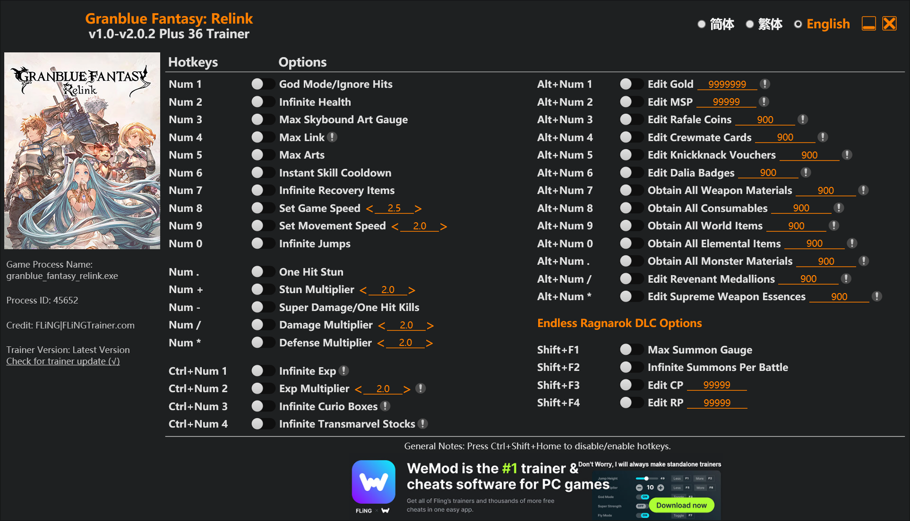

# ⚔️ Granblue Fantasy: Relink Trainer (v1.0-v2.0.2 Plus 36)

A Trainer for **Granblue Fantasy: Relink**. This trainer advanced control over combat parameters, character progression, and character equipment management, allowing you to tailor your gameplay experience in real-time.

---

## 🚀 Key Features

* **Combat:** Toggle invulnerability, instant skill availability, max gauges, and optimized damage/stun multipliers.
* **Streamlined:** Instantly boost EXP, curate boxes, and manage Transmarvel stocks.
* **Resources:** Complete control over Gold, MSP, Rafale Coins, Crewmate Cards, and all rare crafting materials.
* **DLC Expansion:** Dedicated utility options for the *Endless Ragnarok* content, including summon management and high-tier stat editing (CP/RP).

---

## ⌨️ Hotkeys & Options Reference

### ⚔️ Combat & Gameplay
| Hotkey | Option | Description |
| :--- | :--- | :--- |
| **Num 1** | God Mode | Ignore all incoming hits |
| **Num 2** | Infinite Health | Maintain full HP pool |
| **Num 3** | Max Skybound Art | Instantly fill gauge |
| **Num 4** | Max Link | Maximize Link status |
| **Num 5** | Max Arts | Infinite arts capacity |
| **Num 6** | Instant Skill Cooldown | No delay on skill usage |
| **Num 7** | Infinite Recovery Items | Unlimited consumables |
| **Num 8** | Set Game Speed | Adjustable game pacing `< Default: 2.5 >` |
| **Num 9** | Set Movement Speed | Adjustable character speed `< Default: 2.0 >` |
| **Num 0** | Infinite Jumps | Air mobility tweak |
| **Num .** | One Hit Stun | Instantly stun targets |
| **Num +** | Stun Multiplier | Stun damage scaling `< Default: 2.0 >` |
| **Num -** | One Hit Kills | Super Damage mode |
| **Num /** | Damage Multiplier | Adjust output damage `< Default: 2.0 >` |
| **Num \*** | Defense Multiplier | Adjust incoming damage reduction `< Default: 2.0 >` |

### 📈 Progression & Economy
| Hotkey | Cheat Option |
| :--- | :--- |
| **Ctrl + Num 1-4** | Infinite Exp, Exp Multiplier, Infinite Curio Boxes, Infinite Transmarvel Stocks |
| **Alt + Num 1-6** | Edit Gold, MSP, Rafale Coins, Crewmate Cards, Knickknack Vouchers, Dalia Badges |
| **Alt + Num 7-0** | Obtain All Weapon/Consumable/World/Elemental Materials |
| **Alt + Num . / \*** | Edit Revenant Medallions, Supreme Weapon Essences |

### 🌌 Endless Ragnarok DLC
| Hotkey | Cheat Option |
| :--- | :--- |
| **Shift + F1-F2** | Max Summon Gauge, Infinite Summons Per Battle |
| **Shift + F3-F4** | Edit CP (99999), Edit RP (99999) |

---

## 🛠 Installation & Usage

1. **Extract:** Unpack the trainer executable into your game root directory or a dedicated tools folder.
2. **Launch Sequence:** 
   * Launch **Granblue Fantasy: Relink** and load into the game world.
   * Run the trainer executable with **Administrator Privileges**.
3. **Execution:** Use the assigned Numpad/Shift/Alt keys to toggle features. An audio confirmation will verify memory attachment success.

---
